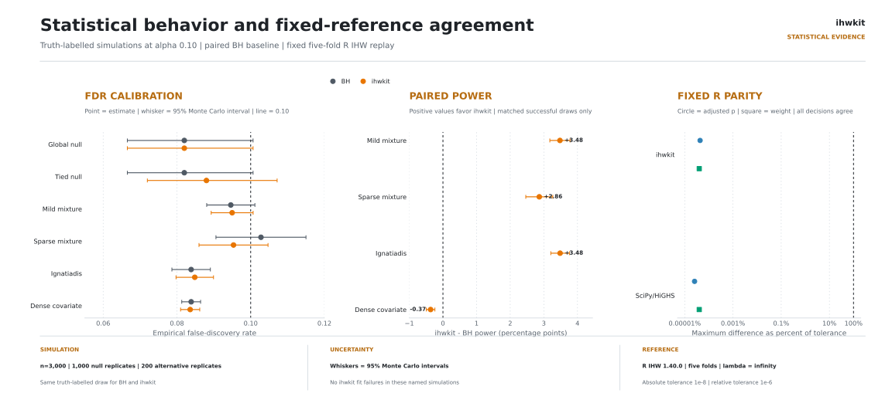
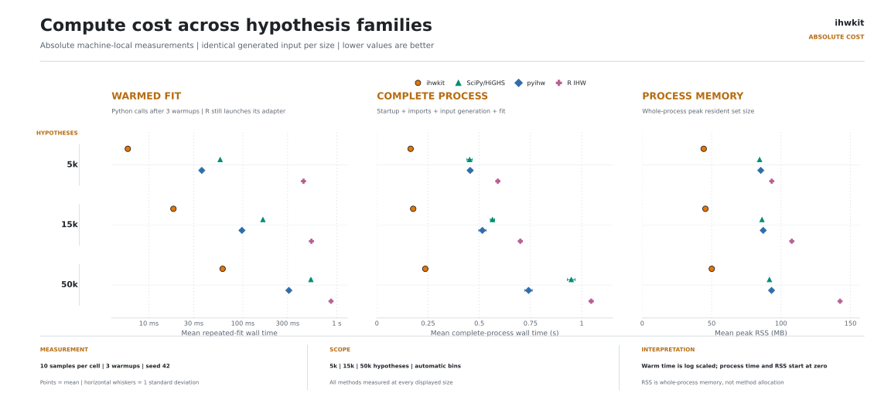

<!-- markdownlint-disable MD033 MD041 -->

<h1 align="center">ihwkit</h1>

<p align="center">
  Independent Hypothesis Weighting with a small, NumPy-only runtime.
</p>

<p align="center">
  
  
  
  <a href="https://github.com/eneskemalergin/ihwkit/actions/workflows/ci.yml"></a>
  
</p>

<p align="center">
  <a href="CHANGELOG.md"></a>
  <a href="CITATION.cff"></a>
  <a href="bench/REPORT.md"></a>
</p>

---

`ihwkit` learns hypothesis weights from an informative covariate, then applies weighted Benjamini-Hochberg or Bonferroni adjustment. The installable implementation is one Python module with one runtime dependency: NumPy.

Version 0.1 keeps the production scope deliberately narrow:

- Five-fold cross-weighting by default.
- The unregularized allocation, also called infinite lambda in the IHW literature.
- Benjamini-Hochberg or Bonferroni adjustment.
- Ordinal covariates with automatic equal-frequency grouping and support for nominal covariates.
- Frozen groups and folds for direct replay, plus full-family group counts for filtered analyses.
- One installed NumPy implementation rather than a backend selector.

Finite regularization is outside the 0.1 scope. Adding it requires separate statistical, numerical, and performance acceptance criteria.

## Install

ihwkit supports CPython 3.12, 3.13, and 3.14 with NumPy 2.5 or newer. It is not on PyPI yet. Install from GitHub:

```bash
git clone https://github.com/eneskemalergin/ihwkit.git
cd ihwkit
python -m pip install .
```

Use `python -m pip install -e .` for editable development. The distribution is named `ihwkit`; the intentionally small import module is `ihw`.

## Use

```python
import numpy as np

from ihw import adjust_ihw

rng = np.random.default_rng(0)
n = 5_000
power_covariate = rng.uniform(size=n)
nonnull = rng.random(n) < 0.1
pvalues = rng.uniform(size=n)

# Null p-values stay independent of the covariate; alternatives strengthen with it.
pvalues[nonnull] = rng.beta(0.8 - 0.6 * power_covariate[nonnull], 1.0)

result = adjust_ihw(pvalues, power_covariate, alpha=0.1, seed=1)
discoveries = np.flatnonzero(result.adj_pvalues <= result.alpha)

result.weights
result.adj_pvalues
discoveries
```

The result also contains weighted p-values, group and fold assignments, the requested alpha, effective bin and fold counts, covariate and adjustment types, and full-family group counts.

`nbins="auto"` selects `max(1, min(40, n // 1500))`. Set it explicitly for a small example that needs more than one group. `exploratory=True` learns and applies weights on one fold for inspection; it is not the confirmatory default. Frozen `groups` and `folds` support direct replay, while `m_groups` supports a filtered subset whose full family counts are known.

Benchmark evidence is centered on ordinal covariates with BH. Nominal covariates and Bonferroni adjustment have structural coverage, but should not be read as equally validated.

## Statistical boundary

IHW needs a covariate that is informative about power while satisfying the required null-independence conditions. A data-derived covariate is not suitable merely because it predicts small p-values. Cross-weighting keeps each hypothesis out of the data used to learn its weight, but it does not repair an invalid covariate, arbitrary dependence, or invalid upstream p-values.

The learned weights depend on the requested `alpha`. Consequently, `adj_pvalues` answer the decision problem for that fitted alpha; one fit should not be presented as an alpha-free q-value curve.

The current simulation study covers named independent-null and mixture scenarios. It does not prove universal FDR control, and it does not cover arbitrary dependence, discrete p-values, or filtered-family designs beyond structural checks. Limits, failed fits, and unavailable peers remain visible in the benchmark report.

## Public evidence

[`bench/REPORT.md`](bench/REPORT.md) keeps correctness, fixed R parity, statistical validity, numerical robustness, speed, and process memory as separate questions. It computes no combined winner score and does not turn an unavailable or failed fit into a successful result.

<p align="center">
  <a href="bench/REPORT.md">
    <picture>
      <source media="(prefers-color-scheme: dark)" srcset="bench/figures/01-statistical-evidence-dark.svg">
      <source media="(prefers-color-scheme: light)" srcset="bench/figures/01-statistical-evidence-light.svg">
      
    </picture>
  </a>
</p>
<p align="center"><sub>Fixed-reference parity, named FDR screens, and paired power comparisons. Open the report for estimands, denominators, failures, absolute timings, process memory, peer ratios, and limitations.</sub></p>

The current recorded study shows:

- Fixed synthetic R replays pass the declared full-vector parity tolerance.
- Across the six named Monte Carlo screens, no 95% FDR interval lies wholly above the nominal 0.10 level.
- Three of four paired power intervals favor ihwkit over BH; the dense-covariate scenario shows a real power loss rather than being hidden by an overall score.
- ihwkit ranks first for warmed fit time, complete-process time, and peak RSS at the reported 5,000- and 50,000-hypothesis scales.

These are results for the recorded scenarios, host, versions, and scales, not universal guarantees. The report compares ihwkit with a distinct SciPy/HiGHS implementation, optional pyihw 0.2.0, R IHW 1.40.0, and unweighted BH where each comparison is meaningful. pyihw 0.2.0 needs Python 3.13 or newer; that does not raise ihwkit's 3.12 floor.

<p align="center">
  <a href="bench/REPORT.md#absolute-compute-cost">
    <picture>
      <source media="(prefers-color-scheme: dark)" srcset="bench/figures/02-process-cost-dark.svg">
      <source media="(prefers-color-scheme: light)" srcset="bench/figures/02-process-cost-light.svg">
      
    </picture>
  </a>
</p>
<p align="center"><sub>Absolute machine-local warmed-fit time, complete-process time, and peak RSS. Lower is better; open the report for measurements, dispersion, versions, and scope.</sub></p>

From a repository checkout, `python -m bench matrix` lists every evidence track. The NumPy-only checks are directly runnable:

```bash
python -m bench correctness
python -m bench parity
python -m bench robustness
python -m bench validity --quick
```

Fixed-reference benchmarks use the two self-contained records in [`bench/data/`](bench/data/README.md); they do not download data or rerun R. The full report documents optional peers, complete-process measurement with zebrac, the retained timing environment, and explicit reference refreshes.

## Coming next

Near-term work, subject to the same evidence checks:

- Broader validation for dependence, discrete p-values, nominal covariates, and filtered families.
- More real omics benchmark shapes, beginning with proteomic, genomic, and donor-level single-cell cases.
- Table-first diagnostics, plus a measured Rust core and Python-binding experiment.

## Development

Local work uses one CPython. The repository suite is:

```bash
uv run --no-project --with pytest --with 'numpy>=2.5' pytest -q
```

That command covers `tests/` and `tools/tests`. SciPy is optional; without it, SciPy peer checks report unavailable and the suite still passes. Pull requests target `dev`.

The installed product is `src/ihw.py`. Package tests live in `tests/`; `bench/` owns the public evidence and fixed records; `tools/` owns simulations and peer adapters. These repository-only files do not enter the wheel.

## Citation

If you use ihwkit, cite the original IHW method and this software. Cite Ignatiadis and Huber (2021) when you discuss theoretical properties of cross-weighting. Cite the Bioconductor IHW R package when you use or compare against that implementation.

ihwkit 0.1 is a NumPy reimplementation of five-fold cross-weighting and the unregularized (infinite-lambda) allocation. It is not a substitute for the full R package, which still provides regularization, nested lambda selection, and plotting. The uncensored path used here is the 2021 asymptotic IHW-BH procedure, not the tau-censored finite-sample construction.

> Ignatiadis, N., Klaus, B., Zaugg, J.B., and Huber, W. (2016). *Data-driven hypothesis weighting increases detection power in genome-scale multiple testing.* Nature Methods 13, 577-580. <https://doi.org/10.1038/nmeth.3885>

> Ignatiadis, N. and Huber, W. (2021). *Covariate powered cross-weighted multiple testing.* Journal of the Royal Statistical Society Series B 83, 720-751. <https://doi.org/10.1111/rssb.12411>

> Ignatiadis, N., Klaus, B., Zaugg, J.B., and Huber, W. (2026). *IHW: Independent Hypothesis Weighting.* R package version 1.40.0. <https://bioconductor.org/packages/IHW>. Source: <https://github.com/nignatiadis/IHW>. Frozen reference records in this repository were generated with IHW 1.40.0.

```bibtex
@article{ignatiadis2016ihw,
  author  = {Ignatiadis, Nikolaos and Klaus, Bernd and Zaugg, Judith B. and Huber, Wolfgang},
  title   = {Data-driven hypothesis weighting increases detection power
             in genome-scale multiple testing},
  journal = {Nature Methods},
  year    = {2016},
  volume  = {13},
  number  = {7},
  pages   = {577--580},
  doi     = {10.1038/nmeth.3885},
}

@article{ignatiadis2021crossweighting,
  author  = {Ignatiadis, Nikolaos and Huber, Wolfgang},
  title   = {Covariate powered cross-weighted multiple testing},
  journal = {Journal of the Royal Statistical Society Series B:
             Statistical Methodology},
  year    = {2021},
  volume  = {83},
  number  = {4},
  pages   = {720--751},
  doi     = {10.1111/rssb.12411},
}

@manual{ignatiadis2026ihw_r,
  author  = {Ignatiadis, Nikolaos and Klaus, Bernd and Zaugg, Judith B. and Huber, Wolfgang},
  title   = {{IHW}: Independent Hypothesis Weighting},
  year    = {2026},
  note    = {R package version 1.40.0},
  url     = {https://bioconductor.org/packages/IHW},
}

@software{ergin_ihwkit_2026,
  author  = {Ergin, Enes Kemal},
  title   = {ihwkit: Independent Hypothesis Weighting with {NumPy}},
  year    = {2026},
  version = {0.1.1},
  url     = {https://github.com/eneskemalergin/ihwkit},
  license = {MIT},
}
```

`CITATION.cff` is in the repository root.

## License

MIT. See [LICENSE](LICENSE).

---

<p align="center"><em>
First frost on the ridge:<br>
a quiet slope draws the weight,<br>
spurious seeds fall.
</em></p>
