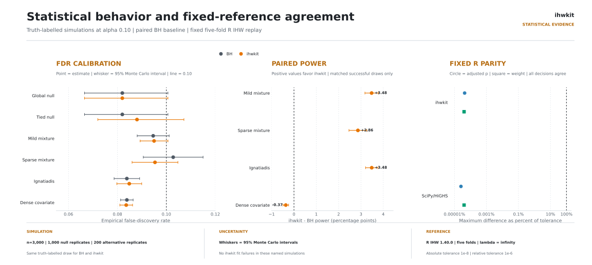
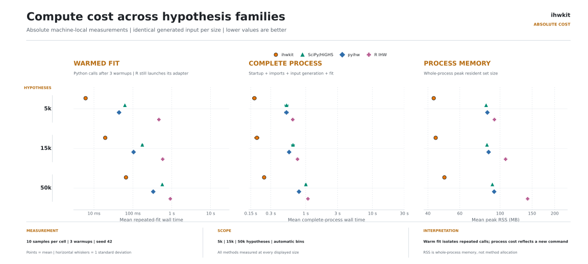
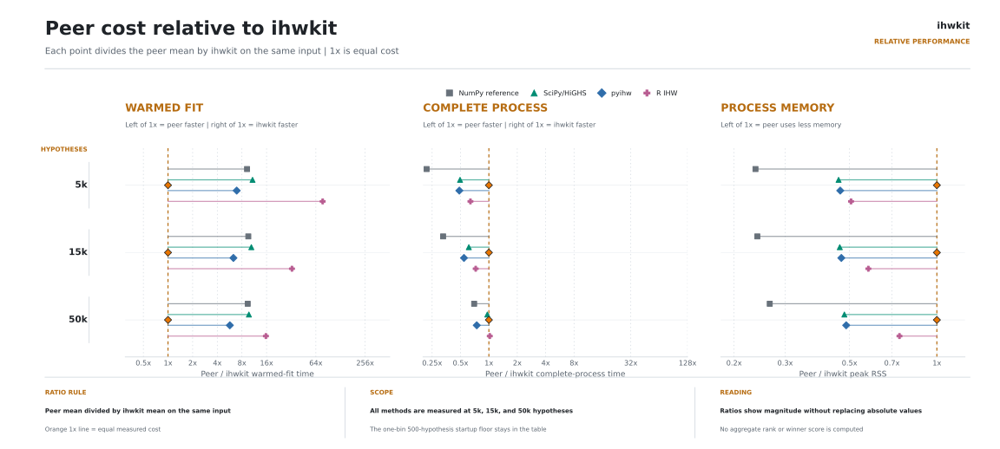

<!-- markdownlint-disable MD033 MD041 -->
# ihwkit benchmark report

Recorded: 2026-08-30T01:24:37+00:00

This is the current measurement baseline for correctness, R parity, statistical behavior, numerical robustness, speed, and process memory. It is a presentation of evidence before optimization, not an optimization claim or a combined winner score. Failed, unavailable, and scope-limited fits remain visible.

## Method labels used throughout

| label | implementation | role in this report |
|---|---|---|
| **ihwkit** | current installable NumPy + Numba method | subject under evaluation |
| **NumPy reference** | retained pre-transition dense NumPy simplex | correctness and scaling reference, not installable API |
| **SciPy/HiGHS** | retained implementation using SciPy's HiGHS solver | numerical and performance reference; never a fallback |
| **pyihw** | public pyihw 0.2.0 package | external Python comparison |
| **R IHW** | Bioconductor IHW 1.40.0 | fixed parity authority and external timing comparison |
| **BH** | unweighted Benjamini-Hochberg | statistical baseline only |

`ihwkit` always means the production method in figures and tables. Longer internal method identifiers appear only in raw JSON.

## Results at a glance

| question | result | judgement |
|---|---:|---|
| repository tests | ok | 90 passed in 2.74s |
| generated correctness | pass | finite output and structural invariants on named cases |
| fixed R parity | pass | strong agreement inside the declared fixed synthetic envelope |
| numerical robustness | 4 failed diagnostics | current release blocker; no fallback concealed the failures |
| validity study | 11 failed ihwkit fits | FDR and power remain conditional on successful fits |
| FDR screen | 0/6 intervals wholly above 0.10 | no clear inflation in these named scenarios; not a universal guarantee |
| paired power | 3/4 intervals wholly above zero | gains in three scenarios and a loss in the dense-covariate scenario |
| performance | 20 process rows + 20 warmed rows | baseline for later profiling, not evidence of completed optimization |

### Direct reading

- **Numerical agreement is strong where it is defined.** The fixed five-fold synthetic replay agrees with R IHW in rejection decisions and full output vectors at errors far below the declared tolerance.
- **Numerical reliability is not finished.** Three airway configurations, the named seed-2034 stress case, and additional validity draws report false LP infeasibility. That blocks a replacement claim regardless of speed.
- **The development-scale statistical result is encouraging but conditional.** This is 1,000 replicates per null scenario and 200 per alternative scenario; 11 ihwkit failures are reported separately instead of converted to zero discoveries.
- **Performance is mixed and size-dependent.** n=5000: median warmed-fit rank 1/5 (5.8x faster than the next measured method); median process-time rank 5/5 and median RSS rank 5/5; n=50000: median warmed-fit rank 2/4 (1.7x slower than pyihw); median process-time rank 4/4 and median RSS rank 4/4.
- **The peer timing environment matches this study.** Peer measurements are reused only while that human-readable environment and protocol remain applicable.

## Statistical evidence

<picture>
  <source media="(prefers-color-scheme: dark)" srcset="figures/01-statistical-evidence-dark.svg">
  <source media="(prefers-color-scheme: light)" srcset="figures/01-statistical-evidence-light.svg">
  
</picture>

The FDR panel shows empirical estimates and 95% Monte Carlo intervals against nominal alpha 0.10. The paired-power panel reports ihwkit minus BH in percentage points; positive values favor ihwkit. The parity panel expresses maximum vector differences as a percentage of the absolute tolerance, so 100% is the declared boundary and farther left is better. Failed ihwkit fits keep their own denominator and never become zero-discovery runs.

<details>
<summary>Simulation designs and statistical estimands</summary>

Every method receives the same truth-labelled draw at alpha 0.10. BH is unweighted; ihwkit uses five folds, automatic bin count, and infinite lambda. For each scenario:

- **Global null:** n=3,000; 1,000 attempts per method. All hypotheses are null; p-values and a continuous uniform covariate are independent.
- **Tied null:** n=3,000; 1,000 attempts per method. All hypotheses are null; p-values are uniform and independent of a rounded, skewed log-normal covariate with ties.
- **Mild mixture:** n=3,000; 200 attempts per method. Ten percent are alternatives; their one-sided normal signal increases with a continuous uniform covariate.
- **Sparse mixture:** n=3,000; 200 attempts per method. Five percent are alternatives under the same covariate-dependent signal model as Mild mixture.
- **Ignatiadis:** n=3,000; 200 attempts per method. Twelve percent are alternatives in the retained Ignatiadis-style covariate-dependent normal model.
- **Dense covariate:** n=3,000; 200 attempts per method. Fifteen percent are alternatives; a wide log-normal covariate drives stronger high-end signals.

FDR is the mean replicate false-discovery proportion. Under either all-null scenario this equals the probability of at least one rejection, and the report uses a Wilson interval; other FDR intervals use the mean plus or minus 1.96 Monte Carlo standard errors, bounded to [0, 1]. Power is the fraction of true alternatives rejected. Paired differences compare ihwkit with BH on the same successful draw; unsuccessful ihwkit fits retain their own denominator and are excluded from the paired estimand.

</details>

## Absolute compute cost

<picture>
  <source media="(prefers-color-scheme: dark)" srcset="figures/02-process-cost-dark.svg">
  <source media="(prefers-color-scheme: light)" srcset="figures/02-process-cost-light.svg">
  
</picture>

Each row is one explicit hypothesis-family size; point position is the sample mean and horizontal timing whiskers are +/- one sample standard deviation. Warmed Python fits remain inside one benchmark process after input construction. R IHW still includes serialization, the adapter, and an R process launch. Complete-process measurements launch a fresh command and therefore include startup, imports, deterministic input generation, solver work, and Numba initialization. Peak RSS is whole-process memory.

The main scaling figures use exactly 5k, 15k, and 50k hypotheses, shown as explicit axis labels. The one-bin n=500 startup floor remains in the detailed tables but is excluded from the scaling figures. The NumPy reference is measured through 15k; its 50k preflight exceeded two minutes and remains an explicit scope-limited cell rather than a fabricated point.

## Relative compute cost

<picture>
  <source media="(prefers-color-scheme: dark)" srcset="figures/03-warm-fit-dark.svg">
  <source media="(prefers-color-scheme: light)" srcset="figures/03-warm-fit-light.svg">
  
</picture>

Every endpoint divides a peer mean by the ihwkit mean on the same input. The orange 1x line is equal measured cost: timing points left of it favor the peer, while points to the right favor ihwkit; memory points to the left use less RSS than ihwkit. Lines expose the magnitude and direction of each comparison without replacing the absolute measurements above. The open NumPy arrows at 50k are lower bounds from its greater-than-two-minute preflight, not fabricated timing samples.

## Detailed statistical results

| scenario | method | ok/attempted | FDR (95% interval) | power | mean rejections |
|---|---|---:|---:|---:|---:|
| Global null | BH | 1000/1000 | 0.082 [0.067, 0.101] |  | 0.1 |
| Global null | ihwkit | 1000/1000 | 0.082 [0.067, 0.101] |  | 0.1 |
| Tied null | BH | 1000/1000 | 0.082 [0.067, 0.101] |  | 0.1 |
| Tied null | ihwkit | 1000/1000 | 0.088 [0.072, 0.107] |  | 0.1 |
| Mild mixture | BH | 200/200 | 0.095 [0.088, 0.101] | 0.138 | 46.0 |
| Mild mixture | ihwkit | 194/200 | 0.094 [0.089, 0.100] | 0.173 | 57.5 |
| Sparse mixture | BH | 200/200 | 0.103 [0.091, 0.115] | 0.091 | 15.5 |
| Sparse mixture | ihwkit | 199/200 | 0.095 [0.086, 0.105] | 0.120 | 20.3 |
| Ignatiadis | BH | 200/200 | 0.084 [0.079, 0.089] | 0.155 | 61.2 |
| Ignatiadis | ihwkit | 198/200 | 0.085 [0.080, 0.090] | 0.190 | 75.0 |
| Dense covariate | BH | 200/200 | 0.084 [0.081, 0.086] | 0.540 | 265.6 |
| Dense covariate | ihwkit | 198/200 | 0.083 [0.081, 0.086] | 0.537 | 263.7 |

Paired differences use only replicates where both BH and production succeeded. They improve precision for method comparison but do not erase production failures.

| scenario | paired reps | FDP difference (MCSE) | power difference (MCSE) |
|---|---:|---:|---:|
| Global null | 1000 | +0.0000 (0.0025) |  |
| Tied null | 1000 | +0.0060 (0.0035) |  |
| Mild mixture | 194 | +0.0008 (0.0031) | +0.0351 (0.0016) |
| Sparse mixture | 199 | -0.0062 (0.0059) | +0.0287 (0.0021) |
| Ignatiadis | 198 | +0.0009 (0.0025) | +0.0349 (0.0014) |
| Dense covariate | 198 | -0.0003 (0.0006) | -0.0037 (0.0007) |

## Performance interpretation before optimization

This round measures and presents the baseline; it does not change the production algorithm. The evidence identifies what later profiling must explain without guessing at causes:

- **Warm fit:** ihwkit leads at 5k but pyihw leads at 50k. The crossover means the present implementation does not support a blanket speed claim.
- **Complete process:** ihwkit currently pays the largest wall-time and memory cost at both headline sizes. Import, JIT, input construction, and fitting are intentionally combined here because that is what a new command experiences.
- **Scope contrast:** process divided by warmed-fit time is descriptive, not a pure startup decomposition. A large factor says that fit-only timing cannot explain command latency; it does not assign the difference to one component.
- **Reliability first:** the false-infeasibility failures must be understood before performance work can support a release claim. A faster solver that fails valid cases is not an improvement.
- **Next optimization evidence:** profile import/JIT initialization, binning and Grenander work, LP construction and solve time, cross-fold repetition, and final BH adjustment separately; profile allocations independently from whole-process RSS.

### Representative measurements at 5k hypotheses

| method | warm median | process median | process / warm | process peak RSS | status |
|---|---:|---:|---:|---:|:---:|
| ihwkit | 7.279 ms | 1.284 s | 176.3x | 189.2 MB | ok |
| NumPy reference | 497.081 ms | 651.889 ms | 1.3x | 43.4 MB | ok |
| SciPy/HiGHS | 66.404 ms | 496.406 ms | 7.5x | 84.0 MB | ok |
| pyihw | 42.065 ms | 466.912 ms | 11.1x | 85.4 MB | ok |
| R IHW | 473.901 ms | 624.404 ms | 1.3x | 93.0 MB | ok |

<details>
<summary>Protocol and comparability details</summary>

The label key at the start of this report defines every implementation. SciPy/HiGHS is a retained comparison and never a production dependency or fallback. BH is a truth-labelled simulation baseline, not a solver-performance peer. pyihw participates in generated-input timing but cannot accept the fixed covariate groups required for stored-vector parity.

All timed IHW lanes use alpha 0.1, five folds, automatic bin count, infinite lambda, seed 42, 3 warmups, and 10 measured samples. Exact parity instead uses the fixed R groups, folds, and fold lambdas stored with the reference.
The dense NumPy reference is measured through 15k. Its 50k preflight exceeded the two-minute method limit, so both timing scopes retain an explicit scope-limited row at 50k.

The n=500 automatic configuration has one bin. R IHW correctly reduces that case to ordinary BH with one effective fold-lambda value; the adapter preserves that result. Because this is a one-bin shortcut dominated by startup, it remains in the detailed tables but not the main scaling figures.

</details>

<details>
<summary>Fixed-reference parity details</summary>

Tolerance: absolute 1e-8 and relative 1e-6.

| method | status | R rej | method rej | max adjusted-p difference | max weight difference | decision agreement |
|---|:---:|---:|---:|---:|---:|---:|
| ihwkit | pass | 159 | 159 | 1.51e-10 | 3.63e-11 | 100.000% |
| NumPy reference | pass | 159 | 159 | 1.38e-10 | 3.63e-11 | 100.000% |
| SciPy/HiGHS | pass | 159 | 159 | 2.55e-15 | 4.00e-15 | 100.000% |
| pyihw | unavailable | 159 |  |  |  |  |

The release gate itself contains one-fold and five-fold synthetic replays. This expanded table shows the five-fold reference across compatible local solvers. An unavailable fixed-partition API is not counted as a parity failure.

</details>

<details>
<summary>Correctness and robustness details</summary>

#### Generated correctness

| case | status | rejections | mean weight | error |
|---|:---:|---:|---:|---|
| sim_500_seed42_inf_n1 | ok | 6 | 1.000000 |  |
| dense_500_seed42_inf_n1 | ok | 45 | 1.000000 |  |
| sim_5000_seed42_inf_n1 | ok | 163 | 1.000000 |  |
| sim_50000_seed42_inf_n1 | ok | 1777 | 1.000000 |  |
| sim_50000_seed42_inf_n5 | ok | 1694 | 1.000000 |  |
| sim_5000_auto_native | ok | 155 | 1.000000 |  |

#### Fixed and generated robustness

| case | production | R rejections | BH on R weights | error |
|---|:---:|---:|:---:|---|
| sim_5000_inf_n1 | pass | 163 | pass |  |
| sim_5000_inf_n5 | pass | 159 | pass |  |
| sim_5000_auto | pass | 158 | pass |  |
| airway_inf_n1 | fail | 4957 | pass | RuntimeError: weight LP did not solve: infeasible solution |
| airway_inf_n5 | fail | 4892 | pass | RuntimeError: weight LP did not solve: infeasible solution |
| airway_auto | fail | 4887 | pass | RuntimeError: weight LP did not solve: infeasible solution |
| mixture_mild_n3000_seed2034_inf_n5 | error |  | n/a | RuntimeError: weight LP did not solve: infeasible solution |

#### Seed-2034 solver comparison

| method | status | rejections | error |
|---|:---:|---:|---|
| ihwkit | error |  | RuntimeError: weight LP did not solve: infeasible solution |
| NumPy reference | ok | 51 |  |
| SciPy/HiGHS | ok | 51 |  |
| pyihw | ok | 49 |  |

Weighted BH using stored R weights passes on the airway rows, so the observed production error occurs before final p-value adjustment. Successful peer fits show that a production failure is not evidence that the mathematical LP is infeasible.

</details>

<details>
<summary>All complete-process measurements</summary>

| n | bins | method | samples | median wall | mean wall | wall SD | median RSS | status |
|---:|---:|---|---:|---:|---:|---:|---:|:---:|
| 500 | 1 | ihwkit | 10 | 303.984 ms | 306.767 ms | 13.590 ms | 109.8 MB | ok |
| 500 | 1 | NumPy reference | 10 | 155.195 ms | 157.075 ms | 10.221 ms | 42.3 MB | ok |
| 500 | 1 | SciPy/HiGHS | 10 | 151.864 ms | 150.517 ms | 7.361 ms | 42.4 MB | ok |
| 500 | 1 | pyihw | 10 | 436.890 ms | 432.432 ms | 13.863 ms | 81.4 MB | ok |
| 500 | 1 | R IHW | 10 | 534.282 ms | 530.431 ms | 8.412 ms | 86.0 MB | ok |
| 5000 | 3 | ihwkit | 10 | 1.284 s | 1.284 s | 29.092 ms | 189.2 MB | ok |
| 5000 | 3 | NumPy reference | 10 | 651.889 ms | 651.201 ms | 13.190 ms | 43.4 MB | ok |
| 5000 | 3 | SciPy/HiGHS | 10 | 496.406 ms | 489.724 ms | 16.213 ms | 84.0 MB | ok |
| 5000 | 3 | pyihw | 10 | 466.912 ms | 472.303 ms | 14.235 ms | 85.4 MB | ok |
| 5000 | 3 | R IHW | 10 | 624.404 ms | 623.155 ms | 5.913 ms | 93.0 MB | ok |
| 15000 | 10 | ihwkit | 10 | 1.336 s | 1.334 s | 58.652 ms | 191.7 MB | ok |
| 15000 | 10 | NumPy reference | 10 | 14.083 s | 14.065 s | 132.808 ms | 45.5 MB | ok |
| 15000 | 10 | SciPy/HiGHS | 10 | 624.785 ms | 622.132 ms | 30.045 ms | 85.6 MB | ok |
| 15000 | 10 | pyihw | 10 | 570.492 ms | 559.343 ms | 21.705 ms | 86.4 MB | ok |
| 15000 | 10 | R IHW | 10 | 728.986 ms | 739.961 ms | 41.133 ms | 107.0 MB | ok |
| 50000 | 33 | ihwkit | 10 | 1.860 s | 1.852 s | 36.362 ms | 206.5 MB | ok |
| 50000 | 33 | NumPy reference | 0 |  |  |  |  | scope_limited |
| 50000 | 33 | SciPy/HiGHS | 10 | 1.029 s | 1.025 s | 19.334 ms | 91.6 MB | ok |
| 50000 | 33 | pyihw | 10 | 797.952 ms | 796.017 ms | 14.311 ms | 93.0 MB | ok |
| 50000 | 33 | R IHW | 10 | 1.090 s | 1.081 s | 22.498 ms | 142.0 MB | ok |

</details>

<details>
<summary>All warmed-fit measurements</summary>

| n | bins | method | samples | median wall | mean wall | wall SD | status |
|---:|---:|---|---:|---:|---:|---:|:---:|
| 500 | 1 | ihwkit | 10 | 390.976 us | 678.673 us | 868.598 us | ok |
| 500 | 1 | NumPy reference | 10 | 211.546 us | 222.762 us | 25.410 us | ok |
| 500 | 1 | SciPy/HiGHS | 10 | 203.071 us | 206.858 us | 10.237 us | ok |
| 500 | 1 | pyihw | 10 | 548.462 us | 554.861 us | 17.675 us | ok |
| 500 | 1 | R IHW | 10 | 397.607 ms | 399.680 ms | 13.503 ms | ok |
| 5000 | 3 | ihwkit | 10 | 7.279 ms | 7.375 ms | 384.086 us | ok |
| 5000 | 3 | NumPy reference | 10 | 497.081 ms | 497.277 ms | 7.966 ms | ok |
| 5000 | 3 | SciPy/HiGHS | 10 | 66.404 ms | 66.524 ms | 1.181 ms | ok |
| 5000 | 3 | pyihw | 10 | 42.065 ms | 42.080 ms | 194.860 us | ok |
| 5000 | 3 | R IHW | 10 | 473.901 ms | 476.952 ms | 13.728 ms | ok |
| 15000 | 10 | ihwkit | 10 | 33.977 ms | 34.110 ms | 722.532 us | ok |
| 15000 | 10 | NumPy reference | 10 | 13.817 s | 13.799 s | 66.847 ms | ok |
| 15000 | 10 | SciPy/HiGHS | 10 | 173.364 ms | 174.066 ms | 4.649 ms | ok |
| 15000 | 10 | pyihw | 10 | 102.178 ms | 103.032 ms | 2.898 ms | ok |
| 15000 | 10 | R IHW | 10 | 553.076 ms | 556.845 ms | 7.897 ms | ok |
| 50000 | 33 | ihwkit | 10 | 541.522 ms | 545.140 ms | 19.822 ms | ok |
| 50000 | 33 | NumPy reference | 0 |  |  |  | scope_limited |
| 50000 | 33 | SciPy/HiGHS | 10 | 558.774 ms | 565.007 ms | 10.556 ms | ok |
| 50000 | 33 | pyihw | 10 | 324.410 ms | 324.576 ms | 3.470 ms | ok |
| 50000 | 33 | R IHW | 10 | 873.801 ms | 875.735 ms | 7.968 ms | ok |

</details>

<details>
<summary>Environment, retained data, and rerun commands</summary>

Peer timing recorded: 2026-08-30T01:06:01+00:00

- **platform:** Linux-7.1.10-200.fc44.x86_64-x86_64-with-glibc2.43
- **cpu:** AMD Ryzen 9 3950X 16-Core Processor
- **logical_cpus:** 32
- **python:** 3.14.7
- **numpy:** 2.5.2
- **numba:** 0.67.0
- **scipy:** 1.18.1
- **pyihw:** 0.2.0
- **zebrac:** zebrac 0.6.2

The retained datasets are deterministic generated draws and the two self-contained files in `bench/data`: one n=5000 synthetic shape and one airway p-value/base-mean shape. No benchmark downloads data; `bench/data/README.md` records their human-readable source and derivation notes.

Run the complete study, reusing the dated peer timing table:

```bash
uv run --no-project --with pytest --with numpy --with numba --with scipy --with pyihw==0.2.0 --with matplotlib python -m bench study
```

Refresh unchanged peers only when their code, runtime, machine, or benchmark protocol changes:

```bash
uv run --no-project --with pytest --with numpy --with numba --with scipy --with pyihw==0.2.0 --with matplotlib python -m bench study --refresh-peers
```

Render the report again without rerunning measurements:

```bash
uv run --no-project --with numpy --with numba --with matplotlib python -m bench report
```

</details>

## Limits and next datasets

- The current real-data evidence is one airway shape. It is a useful numerical stress case, not broad real-data coverage.
- No reviewed local single-cell export is present, so real single-cell calibration, realistic count-based power, and donor-stability panels remain unmeasured.
- The statistical simulations assume the named data-generating mechanisms. They do not establish FDR control under arbitrary dependence, discrete p-values, or invalid covariates.
- Peak RSS is whole-process memory. It cannot be interpreted as solver allocation alone.
- Machine-local performance is evidence for this environment, not a universal speed or memory guarantee.

The simulation structure follows the ADEMP framework from [Morris, White, and Crowther (2019)](https://doi.org/10.1002/sim.8086). The separation of datasets, metrics, failures, and method scope follows the benchmarking guidance of [Weber et al. (2019)](https://doi.org/10.1186/s13059-019-1738-8). The report layout borrows z-fasta's useful pattern of correctness-first execution, absolute and ratio plots, and collapsible detailed evidence while intentionally using a much smaller local implementation.
