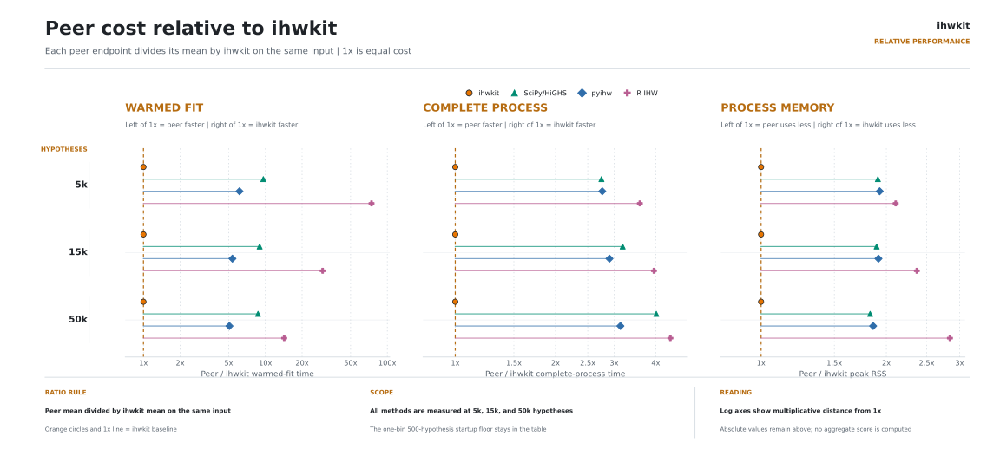

<!-- markdownlint-disable MD033 MD041 -->

# ihwkit benchmark report

Recorded: 2026-09-12T07:51:34+00:00

This is the current measurement baseline for correctness, R parity, statistical behavior, numerical robustness, speed, and process memory. It is a presentation of evidence, not a combined winner score. Failed and unavailable fits remain visible.

## Method labels used throughout

| label           | implementation                                                   | role in this report                                   |
| --------------- | ---------------------------------------------------------------- | ----------------------------------------------------- |
| **ihwkit**      | installable low-memory NumPy method; five-fold unregularized IHW | subject under evaluation                              |
| **SciPy/HiGHS** | retained implementation using SciPy's HiGHS solver               | numerical and performance reference; never a fallback |
| **pyihw**       | public pyihw 0.2.0 package                                       | external Python comparison                            |
| **R IHW**       | Bioconductor IHW 1.40.0                                          | fixed parity authority and external timing comparison |
| **BH**          | unweighted Benjamini-Hochberg                                    | statistical baseline only                             |

`ihwkit` always means the production method in figures and tables. Longer internal method identifiers appear only in raw JSON.

## Results at a glance

| question              |                           result | judgement                                                              |
| --------------------- | -------------------------------: | ---------------------------------------------------------------------- |
| repository tests      |                               ok | 85 passed in 1.95s                                                     |
| generated correctness |                             pass | valid numerical output and structural invariants on named cases        |
| fixed R parity        |                             pass | strong agreement inside the declared fixed synthetic envelope          |
| numerical robustness  |             0 failed diagnostics | tested unregularized cases pass; broader robustness remains unclaimed  |
| validity study        |             0 failed ihwkit fits | FDR and power remain conditional on successful fits                    |
| FDR screen            |  0/6 intervals wholly above 0.10 | no clear inflation in these named scenarios; not a universal guarantee |
| paired power          |  3/4 intervals wholly above zero | gains in three scenarios and a loss in the dense-covariate scenario    |
| performance           | 16 process rows + 16 warmed rows | current direct-default measurements; no universal speed claim          |

### Direct reading

- **Numerical agreement is strong where it is defined.** The fixed five-fold synthetic replay agrees with R IHW in rejection decisions and full output vectors at errors far below the declared tolerance.
- **The named numerical envelope passes.** Every named robustness diagnostic passed; this remains evidence for the tested cases rather than a universal numerical guarantee.
- **The development-scale statistical result is encouraging but conditional.** This is 1,000 replicates per null scenario and 200 per alternative scenario; 0 ihwkit failures are reported separately instead of converted to zero discoveries.
- **Performance is favorable on the measured scaling inputs and remains size-dependent.** n=5000: median warmed-fit rank 1/4 (6.1x faster than the next measured method); median process-time rank 1/4 and median RSS rank 1/4; n=50000: median warmed-fit rank 1/4 (5.1x faster than the next measured method); median process-time rank 1/4 and median RSS rank 1/4.
- **The peer timing environment matches this study.** Peer measurements are reused only while that human-readable environment and protocol remain applicable.

## Statistical evidence

<picture>
  <source media="(prefers-color-scheme: dark)" srcset="figures/01-statistical-evidence-dark.svg">
  <source media="(prefers-color-scheme: light)" srcset="figures/01-statistical-evidence-light.svg">
  
</picture>

The FDR panel shows empirical estimates and 95% Monte Carlo intervals against nominal alpha 0.10. The paired-power panel reports ihwkit minus BH in percentage points; positive values favor ihwkit. The parity panel expresses maximum vector differences as a percentage of the absolute tolerance, so 100% is the declared boundary and farther left is better. Failed ihwkit fits keep their own denominator and never become zero-discovery runs.

<details>
<summary>Simulation designs and statistical estimands</summary>

Every method receives the same truth-labelled draw at alpha 0.10. BH is unweighted; ihwkit uses five folds, automatic bin count, and the current unregularized allocation. For each scenario:

- **Global null:** n=3,000; 1,000 attempts per method. All hypotheses are null; p-values and a continuous uniform covariate are independent.
- **Tied null:** n=3,000; 1,000 attempts per method. All hypotheses are null; p-values are uniform and independent of a rounded, skewed log-normal covariate with ties.
- **Mild mixture:** n=3,000; 200 attempts per method. Ten percent are alternatives; their one-sided normal signal increases with a continuous uniform covariate.
- **Sparse mixture:** n=3,000; 200 attempts per method. Five percent are alternatives under the same covariate-dependent signal model as Mild mixture.
- **Ignatiadis:** n=3,000; 200 attempts per method. Twelve percent are alternatives in the retained Ignatiadis-style covariate-dependent normal model.
- **Dense covariate:** n=3,000; 200 attempts per method. Fifteen percent are alternatives; a wide log-normal covariate drives stronger high-end signals.

FDR is the mean replicate false-discovery proportion. Under either all-null scenario this equals the probability of at least one rejection, and the report uses a Wilson interval; other FDR intervals use the mean plus or minus 1.96 Monte Carlo standard errors, bounded to [0, 1]. Power is the fraction of true alternatives rejected. Paired differences compare ihwkit with BH on the same successful draw; unsuccessful ihwkit fits retain their own denominator and are excluded from the paired estimand.

</details>

## Absolute compute cost

<picture>
  <source media="(prefers-color-scheme: dark)" srcset="figures/02-process-cost-dark.svg">
  <source media="(prefers-color-scheme: light)" srcset="figures/02-process-cost-light.svg">
  
</picture>

Each row is one explicit hypothesis-family size; point position is the sample mean and horizontal timing whiskers are +/- one sample standard deviation. The warmed-fit panel uses logarithmic spacing because those measurements span orders of magnitude; complete-process time and RSS use zero-based linear axes. Warmed Python fits remain inside one benchmark process after input construction. R IHW still includes serialization, the adapter, and an R process launch. Complete-process measurements launch a fresh command and therefore include startup, imports, deterministic input generation, fitting work, and any method-specific initialization. Peak RSS is whole-process memory.

The main scaling figures use exactly 5k, 15k, and 50k hypotheses, shown as explicit axis labels. The one-bin n=500 startup floor remains in the detailed tables but is excluded from the scaling figures.

## Relative compute cost

<picture>
  <source media="(prefers-color-scheme: dark)" srcset="figures/03-warm-fit-dark.svg">
  <source media="(prefers-color-scheme: light)" srcset="figures/03-warm-fit-light.svg">
  
</picture>

Every peer endpoint divides its mean by the ihwkit mean on the same input. The orange circles and 1x line mark the ihwkit baseline: points left of it favor the peer, while points to the right favor ihwkit for both time and memory. All three ratio axes use logarithmic spacing, so the same multiplicative change occupies the same horizontal distance. Lines expose the magnitude and direction of each comparison without replacing the absolute measurements above.

## Detailed statistical results

| scenario        | method | ok/attempted |   FDR (95% interval) | power | mean rejections |
| --------------- | ------ | -----------: | -------------------: | ----: | --------------: |
| Global null     | BH     |    1000/1000 | 0.082 [0.067, 0.101] |       |             0.1 |
| Global null     | ihwkit |    1000/1000 | 0.082 [0.067, 0.101] |       |             0.1 |
| Tied null       | BH     |    1000/1000 | 0.082 [0.067, 0.101] |       |             0.1 |
| Tied null       | ihwkit |    1000/1000 | 0.088 [0.072, 0.107] |       |             0.1 |
| Mild mixture    | BH     |      200/200 | 0.095 [0.088, 0.101] | 0.138 |            46.0 |
| Mild mixture    | ihwkit |      200/200 | 0.095 [0.089, 0.101] | 0.173 |            57.6 |
| Sparse mixture  | BH     |      200/200 | 0.103 [0.091, 0.115] | 0.091 |            15.5 |
| Sparse mixture  | ihwkit |      200/200 | 0.095 [0.086, 0.105] | 0.119 |            20.2 |
| Ignatiadis      | BH     |      200/200 | 0.084 [0.079, 0.089] | 0.155 |            61.2 |
| Ignatiadis      | ihwkit |      200/200 | 0.085 [0.080, 0.090] | 0.190 |            75.0 |
| Dense covariate | BH     |      200/200 | 0.084 [0.081, 0.086] | 0.540 |           265.6 |
| Dense covariate | ihwkit |      200/200 | 0.084 [0.081, 0.086] | 0.536 |           263.7 |

Paired differences use only replicates where both BH and production succeeded. They improve precision for method comparison but do not erase production failures.

| scenario        | paired reps | FDP difference (MCSE) | power difference (MCSE) |
| --------------- | ----------: | --------------------: | ----------------------: |
| Global null     |        1000 |      +0.0000 (0.0025) |                         |
| Tied null       |        1000 |      +0.0060 (0.0035) |                         |
| Mild mixture    |         200 |      +0.0004 (0.0030) |        +0.0348 (0.0015) |
| Sparse mixture  |         200 |      -0.0074 (0.0060) |        +0.0286 (0.0020) |
| Ignatiadis      |         200 |      +0.0010 (0.0025) |        +0.0348 (0.0014) |
| Dense covariate |         200 |      -0.0003 (0.0006) |        -0.0037 (0.0007) |

## Performance interpretation

ihwkit 0.1 solves the unregularized Grenander allocation directly in NumPy. The retained SciPy lane solves the same tested problem through a dense LP; it is a comparison, not a dependency or fallback.

- **Measured position:** n=5000: median warmed-fit rank 1/4 (6.1x faster than the next measured method); median process-time rank 1/4 and median RSS rank 1/4; n=50000: median warmed-fit rank 1/4 (5.1x faster than the next measured method); median process-time rank 1/4 and median RSS rank 1/4.
- **Complete process:** Import, method initialization, input construction, and fitting are intentionally combined because that is what a new command experiences.
- **Scope contrast:** process divided by warmed-fit time is descriptive, not a pure startup decomposition. A large factor says that fit-only timing cannot explain command latency; it does not assign the difference to one component.
- **Numerical boundary:** these results cover the named unregularized cases only. Finite regularization remains roadmap work and receives no claim here.

### Representative measurements at 5k hypotheses

| method      | warm median | process median | process / warm | process peak RSS | status |
| ----------- | ----------: | -------------: | -------------: | ---------------: | :----: |
| ihwkit      |    5.961 ms |     162.737 ms |          27.3x |          44.4 MB |   ok   |
| SciPy/HiGHS |   57.425 ms |     448.613 ms |           7.8x |          84.7 MB |   ok   |
| pyihw       |   36.559 ms |     455.870 ms |          12.5x |          85.5 MB |   ok   |
| R IHW       |  443.622 ms |     588.007 ms |           1.3x |          93.5 MB |   ok   |

<details>
<summary>Protocol and comparability details</summary>

The label key at the start of this report defines every implementation. SciPy/HiGHS is a retained comparison and never a production dependency or fallback. BH is a truth-labelled simulation baseline, not a solver-performance peer. pyihw participates in generated-input timing but cannot accept the fixed covariate groups required for stored-vector parity.

All timed IHW lanes use alpha 0.1, five folds, automatic bin count, the unregularized allocation, seed 42, 3 warmups, and 10 measured samples. Exact parity instead uses the fixed R groups and folds stored with the reference.

The n=500 automatic configuration has one bin. Every implementation reduces that case to ordinary BH. Because this shortcut is dominated by startup, it remains in the detailed tables but not the main scaling figures.

</details>

<details>
<summary>Fixed-reference parity details</summary>

Tolerance: absolute 1e-8 and relative 1e-6.

| method      |    status   | R rej | method rej | max adjusted-p difference | max weight difference | decision agreement |
| ----------- | :---------: | ----: | ---------: | ------------------------: | --------------------: | -----------------: |
| ihwkit      |     pass    |   159 |        159 |                  4.33e-15 |              4.00e-15 |           100.000% |
| SciPy/HiGHS |     pass    |   159 |        159 |                  2.55e-15 |              4.00e-15 |           100.000% |
| pyihw       | unavailable |   159 |            |                           |                       |                    |

The release gate itself contains one-fold and five-fold synthetic replays. This expanded table shows the five-fold reference across compatible local methods. An unavailable fixed-partition API is not counted as a parity failure.

</details>

<details>
<summary>Correctness and robustness details</summary>

#### Generated correctness

| case                | status | rejections | mean weight | error |
| ------------------- | :----: | ---------: | ----------: | ----- |
| sim_500_seed42_n1   |   ok   |          6 |    1.000000 |       |
| dense_500_seed42_n1 |   ok   |         45 |    1.000000 |       |
| sim_5000_seed42_n1  |   ok   |        163 |    1.000000 |       |
| sim_50000_seed42_n1 |   ok   |       1777 |    1.000000 |       |
| sim_50000_seed42_n5 |   ok   |       1694 |    1.000000 |       |

#### Fixed and generated robustness

| case                           | production | R rejections | BH on R weights | error |
| ------------------------------ | :--------: | -----------: | :-------------: | ----- |
| sim_5000_inf_n1                |    pass    |          163 |       pass      |       |
| sim_5000_inf_n5                |    pass    |          159 |       pass      |       |
| airway_inf_n1                  |    pass    |         4957 |       pass      |       |
| airway_inf_n5                  |    pass    |         4892 |       pass      |       |
| mixture_mild_n3000_seed2034_n5 |     ok     |              |       n/a       |       |

#### Seed-2034 numerical comparison

| method      | status | rejections | error |
| ----------- | :----: | ---------: | ----- |
| ihwkit      |   ok   |         51 |       |
| SciPy/HiGHS |   ok   |         50 |       |
| pyihw       |   ok   |         49 |       |

Weighted BH using stored R weights passes on every retained airway row. The one-fold and five-fold airway replays test the current unregularized method on a real-data shape; they do not validate unimplemented finite regularization.

</details>

<details>
<summary>All complete-process measurements</summary>

|     n | bins | method      | samples | median wall |  mean wall |   wall SD | median RSS | status |
| ----: | ---: | ----------- | ------: | ----------: | ---------: | --------: | ---------: | :----: |
|   500 |    1 | ihwkit      |      10 |  151.084 ms | 155.814 ms | 13.065 ms |    43.5 MB |   ok   |
|   500 |    1 | SciPy/HiGHS |      10 |  143.514 ms | 144.318 ms |  6.599 ms |    42.3 MB |   ok   |
|   500 |    1 | pyihw       |      10 |  415.198 ms | 413.164 ms | 14.902 ms |    81.7 MB |   ok   |
|   500 |    1 | R IHW       |      10 |  512.725 ms | 514.208 ms |  9.012 ms |    85.9 MB |   ok   |
|  5000 |    3 | ihwkit      |      10 |  162.737 ms | 164.780 ms |  8.769 ms |    44.4 MB |   ok   |
|  5000 |    3 | SciPy/HiGHS |      10 |  448.613 ms | 452.803 ms | 13.165 ms |    84.7 MB |   ok   |
|  5000 |    3 | pyihw       |      10 |  455.870 ms | 455.495 ms | 11.122 ms |    85.5 MB |   ok   |
|  5000 |    3 | R IHW       |      10 |  588.007 ms | 590.631 ms |  6.787 ms |    93.5 MB |   ok   |
| 15000 |   10 | ihwkit      |      10 |  177.535 ms | 177.327 ms |  4.450 ms |    45.7 MB |   ok   |
| 15000 |   10 | SciPy/HiGHS |      10 |  562.636 ms | 564.308 ms | 10.339 ms |    86.4 MB |   ok   |
| 15000 |   10 | pyihw       |      10 |  512.508 ms | 515.088 ms | 17.683 ms |    87.2 MB |   ok   |
| 15000 |   10 | R IHW       |      10 |  699.208 ms | 700.504 ms |  7.363 ms |   107.8 MB |   ok   |
| 50000 |   33 | ihwkit      |      10 |  237.730 ms | 236.408 ms |  5.042 ms |    50.2 MB |   ok   |
| 50000 |   33 | SciPy/HiGHS |      10 |  947.290 ms | 949.314 ms | 19.052 ms |    92.1 MB |   ok   |
| 50000 |   33 | pyihw       |      10 |  752.549 ms | 740.711 ms | 17.724 ms |    93.3 MB |   ok   |
| 50000 |   33 | R IHW       |      10 |     1.044 s |    1.046 s |  9.303 ms |   142.5 MB |   ok   |

</details>

<details>
<summary>All warmed-fit measurements</summary>

|     n | bins | method      | samples | median wall |  mean wall |    wall SD | status |
| ----: | ---: | ----------- | ------: | ----------: | ---------: | ---------: | :----: |
|   500 |    1 | ihwkit      |      10 |  176.835 us | 177.879 us |   3.946 us |   ok   |
|   500 |    1 | SciPy/HiGHS |      10 |  352.212 us | 353.885 us |   5.620 us |   ok   |
|   500 |    1 | pyihw       |      10 |  206.456 us | 216.430 us |  20.184 us |   ok   |
|   500 |    1 | R IHW       |      10 |  359.977 ms | 359.992 ms |   3.400 ms |   ok   |
|  5000 |    3 | ihwkit      |      10 |    5.961 ms |   5.966 ms |  14.859 us |   ok   |
|  5000 |    3 | SciPy/HiGHS |      10 |   57.425 ms |  57.407 ms | 145.546 us |   ok   |
|  5000 |    3 | pyihw       |      10 |   36.559 ms |  36.586 ms |  81.566 us |   ok   |
|  5000 |    3 | R IHW       |      10 |  443.622 ms | 442.909 ms |   7.660 ms |   ok   |
| 15000 |   10 | ihwkit      |      10 |   18.242 ms |  18.251 ms |  91.866 us |   ok   |
| 15000 |   10 | SciPy/HiGHS |      10 |  163.435 ms | 163.754 ms |   1.702 ms |   ok   |
| 15000 |   10 | pyihw       |      10 |   97.926 ms |  97.932 ms | 529.036 us |   ok   |
| 15000 |   10 | R IHW       |      10 |  536.996 ms | 538.102 ms |   5.526 ms |   ok   |
| 50000 |   33 | ihwkit      |      10 |   60.989 ms |  61.006 ms | 165.912 us |   ok   |
| 50000 |   33 | SciPy/HiGHS |      10 |  529.275 ms | 531.014 ms |   9.276 ms |   ok   |
| 50000 |   33 | pyihw       |      10 |  309.392 ms | 309.404 ms |   1.713 ms |   ok   |
| 50000 |   33 | R IHW       |      10 |  868.459 ms | 869.703 ms |   7.847 ms |   ok   |

</details>

<details>
<summary>Environment, retained data, and rerun commands</summary>

Peer timing recorded: 2026-09-12T07:50:38+00:00

- **platform:** Linux-7.2.4-200.fc44.x86_64-x86_64-with-glibc2.43
- **cpu:** AMD Ryzen 9 3950X 16-Core Processor
- **logical_cpus:** 32
- **python:** 3.14.7
- **numpy:** 2.5.2
- **scipy:** 1.18.1
- **pyihw:** 0.2.0
- **zebrac:** zebrac 0.6.2

The retained datasets are deterministic generated draws and the two self-contained files in `bench/data`: one n=5000 synthetic shape and one airway p-value/base-mean shape. No benchmark downloads data; `bench/data/README.md` records their human-readable source and derivation notes.

Run the complete study, reusing the dated peer timing table:

```bash
uv run --no-project --with pytest --with 'numpy>=2.5' --with scipy --with pyihw==0.2.0 --with matplotlib python -m bench study
```

Refresh unchanged peers only when their code, runtime, machine, or benchmark protocol changes:

```bash
uv run --no-project --with pytest --with 'numpy>=2.5' --with scipy --with pyihw==0.2.0 --with matplotlib python -m bench study --refresh-peers
```

Render the report again without rerunning measurements:

```bash
uv run --no-project --with 'numpy>=2.5' --with matplotlib python -m bench report
```

</details>

## Limits and next datasets

- The current real-data evidence is one airway shape. It is a useful numerical stress case, not broad real-data coverage.
- No reviewed local single-cell export is present, so real single-cell calibration, realistic count-based power, and donor-stability panels remain unmeasured.
- The statistical simulations assume the named data-generating mechanisms. They do not establish FDR control under arbitrary dependence, discrete p-values, or invalid covariates.
- Finite regularization, broader statistical procedures, and diagnostic plotting remain future work, not hidden 0.1 features.
- Peak RSS is whole-process memory. It cannot be interpreted as method-specific allocation alone.
- Machine-local performance is evidence for this environment, not a universal speed or memory guarantee.

The simulation structure follows the ADEMP framework from [Morris, White, and Crowther (2019)](https://doi.org/10.1002/sim.8086). The separation of datasets, metrics, failures, and method scope follows the benchmarking guidance of [Weber et al. (2019)](https://doi.org/10.1186/s13059-019-1738-8). The report layout borrows z-fasta's useful pattern of correctness-first execution, absolute and ratio plots, and collapsible detailed evidence while intentionally using a much smaller local implementation.
